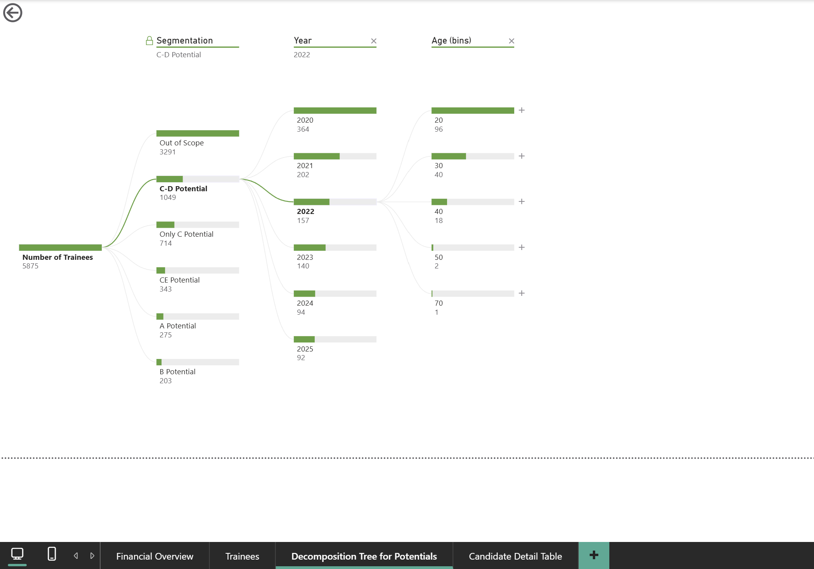
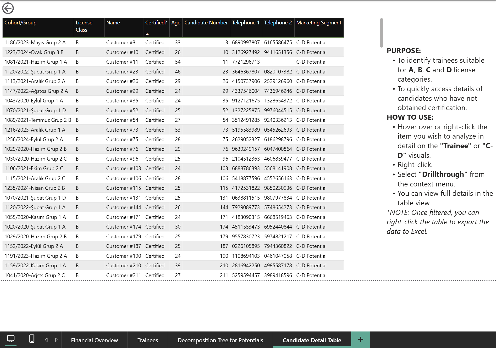
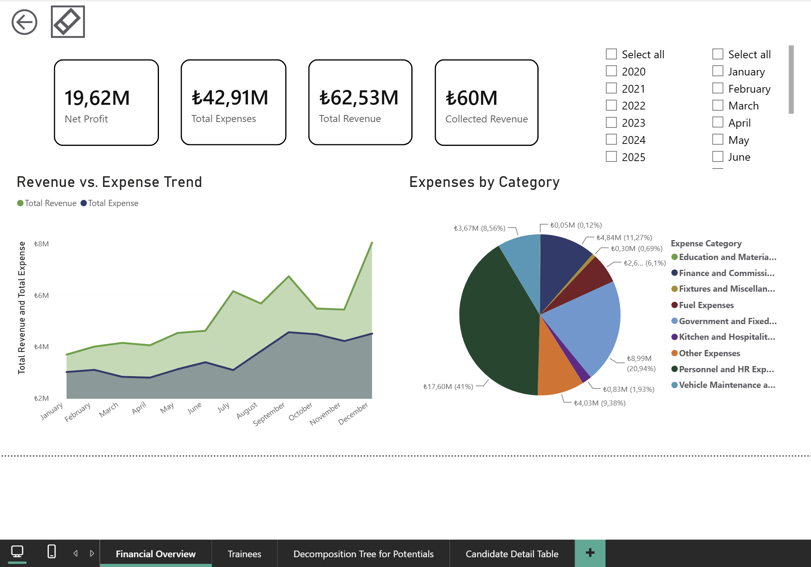

# Dashboard

Four report pages, built in Power BI. Candidate names and phone numbers are anonymized. Monetary values in the Financial Overview page are scaled; category percentages are real.

These screenshots document the original report, not the synthetic public demo. The licence-upgrade funnel (200 contacts → 47 interested → 12 enrolled) and the separate 8-enrolment launch-month observation are defined under [Numbers](../README.md#numbers). The screenshots do not establish their reporting periods or whether the enrolment counts overlap.

**Presentation QA:** In the downloadable PBIP, the lower trainee KPI reads **Not Certified**, and the nine-category expense pie has been replaced by a descending horizontal bar with direct value labels. These changes remove the truncated card caption and ellipsized expense legend visible in the earlier screenshots without changing the underlying measures.

---

## Decomposition Tree for Potentials

The entry point for targeting. A trainee count breaks down by segment, then by year, then by age band, so a user can narrow in on exactly who they need. If a given month's C, D, or E capacity is full, the same tree opens straight into the A or B segments instead. Right-clicking any branch drills through to the detail table below.

## Candidate Detail Table

Where the tree leads. Cohort, licence class, age, certification status, phone numbers, and the assigned marketing segment, all in one row per trainee. This is the list that turns into a call.

## Trainees

Certification volume and outcomes across licence classes since 2020. The rising line is the cost-per-trainee trend, which the README notes is nominal, not adjusted for inflation. The bars on the right show how certification success rate varies by class.

## Financial Overview

Revenue, expenses, and the resulting margin, broken down by category and tracked month to month. This page answers a question the trainee data alone couldn't: what it actually costs to run the school day to day.
